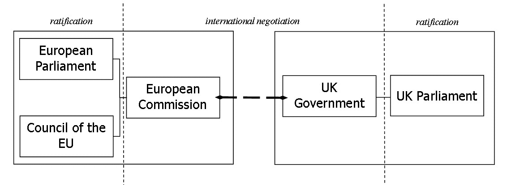
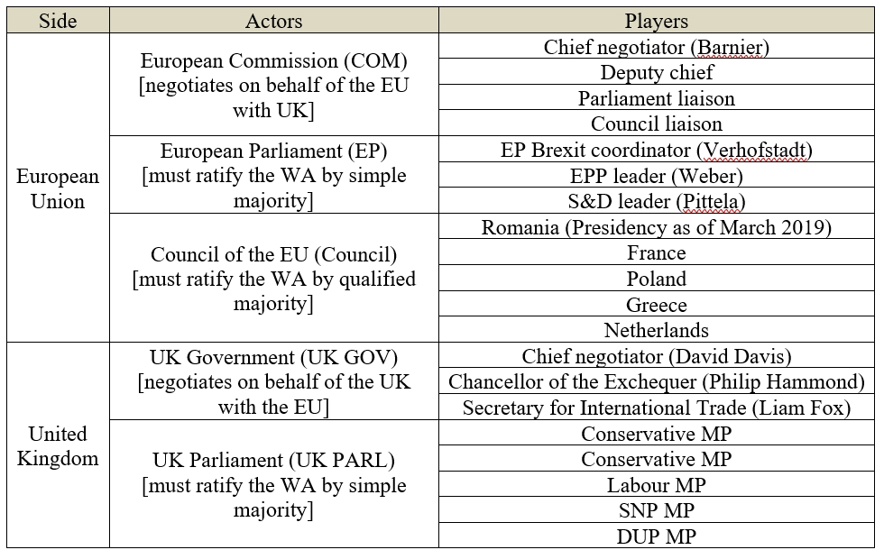
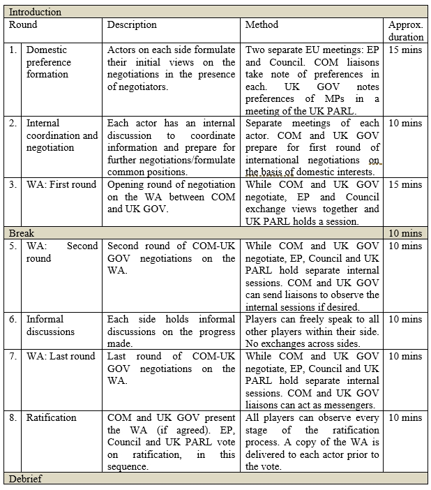
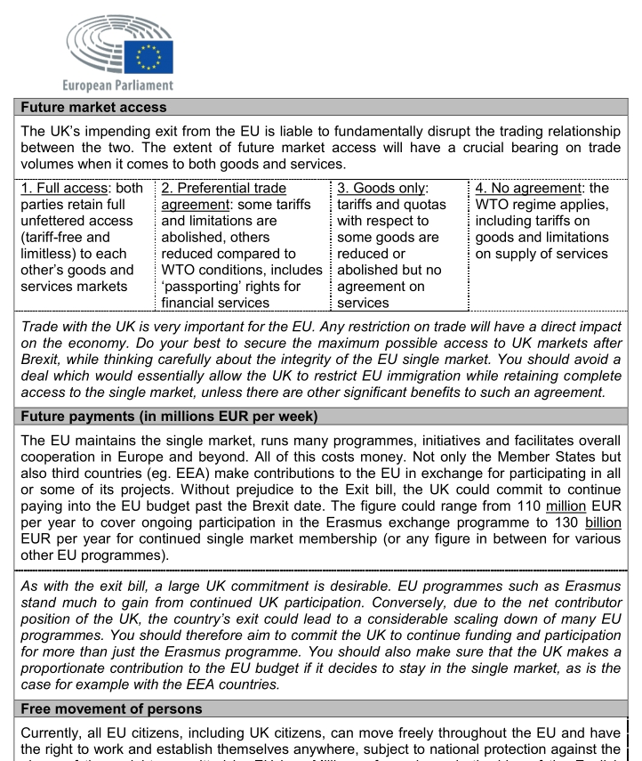

In October 2017 I ran a tutorial at KU Leuven that simulated the Brexit negotiations as a two-level game [(Putnam 1988)](https://www.jstor.org/stable/2706785?seq=1#page_scan_tab_contents) with mixed-motive bargaining. The Brexit Negotiations Game (BNG) was designed to impart basic understanding of international negotiations to students with a law background in a short space of time (4 hours of preparation, 2 hours in class). The average class size was approximately 20 students. Although the class required extensive preparation (22 individually drafted actor-specific dossiers), it received extremely positive feedback from students.

## Simulation setup

The game takes place in the week leading up to the day Brexit materializes, i.e. 29 March 2019. The central objective of the game is to negotiate and ratify the Withdrawal Agreement (WA) on terms viewed as most advantageous by each side, actor and player. This will necessarily entail trade-offs and some players/actors might win more than others (some might even lose out entirely). The interests of some players and actors can overlap to an extent, but no two actors/players share the exact same preferences. Note that for the purposes of the BNG the withdrawal agreement may also contain commitments regarding the future EU-UK (trade) relationship.

The negotiation of the WA is only successful if both sides also ratify the agreement. As ratification entails specific domestic constraints of which both sides are mindful, the final WA must be such as to satisfy the domestic actors’ preferences in order for them to support its ratification. In the language of Putnam, the win-sets at both Level I and Level II must overlap.

### Actors

In order to bear out Putnam's two-level game theory in practice, two levels of negotiation were created on both the EU and the UK side.

Each side (EU/UK) consisted of institutional actors which were in turn made up of the individual players. No side and no actor had completely homogenous preferences; players were instructed to pursue their individual preferences (which varied) even within their institution. The extent to which they have done so depended, however, on their negotiating style.

### Sequencing

The BNG takes place through successive rounds of simultaneous negotiations. Formal negotiations are followed by informal consultations during which information on each side can be exchanged more freely among the actors and the players. During formal negotiation rounds all players must take their designated place at the table of the actor to whom they belong. Each round adheres to a time limit, although formal rounds can be terminated before the expiry of the time limit upon mutual agreement of the players concerned. It will be the responsibility of all actors to observe the time limits for the sake of successfully reaching and ratifying the agreement.

### Individual dossiers

Each student received an individual dossier prior to the game. This dossier was confidential and contained player-specific preferences, as well as a brief 'mission statement'. Each player was made aware of a pre-defined menu of options concerning each issue; the domestic preference-forming players had, in addition, an indication of which option they should prefer.

## Negotiated agreements

In the final phase of the simulation, the negotiating teams (COM/UK GOV) had to draw up a withdrawal agreement, specifying what was agreed on the various issues. The agreement was subsequently put through a ratification process on each side. Only one group did not manage to ratify their agreement.

## Feedback

The BNG was part of a tutorial series consisting of 8 tutorials. 73% of students (n = 102) rated the BNG as the best tutorial in the series (10% ranked it second best). On a scale of 1 to 4 (very interesting to not interesting), 57% of students rated the class as very interesting and 27% as interesting (the rest did not provide feedback). When asked which tutorial best focused on developing skills, 83% chose the BNG (as one of two options).

Essentially all students were happy with the design of the simulation and did not suggest any changes. A few selected remarks from the students (translated from Dutch):

- "This tutorial was my favorite. I found it very interesting and hope that it will continue to exist in its current form. It was very interesting to prepare and I learned a lot about an issue that is current. It was also exciting to discover which agreement came to the end and whether it would come through. Great tutorial, certainly keep it!"

- "Extremely interesting format. You could also convey this subject in a very dry way, but by letting us each defend our own position, we first got insight into the difficulties involved in negotiations, certainly in a debate with many different actors, each with their own interests. In addition, we were able to properly capture the complex position of each party. The subject matter also remains very good: I would still be able to explain the positions of the different countries, which would not be the case with an ordinary course."

- "I would not change anything. Everything happened in a very smooth way and everyone knew exactly what position he / she had to defend."
