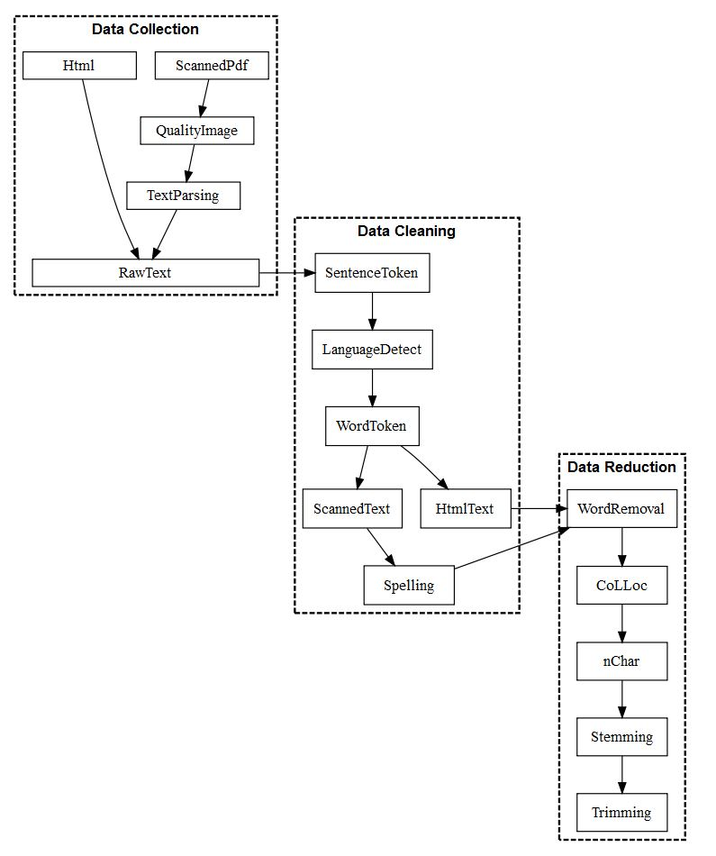

In my work I often resort to topic modelling to summarize otherwise intractable textual corpora. Anyone even vaguely familiar with topic modelling and quantitative text methods more generally will acknowledge that how the raw text is prepared in the run-up to analysis is of critical importance. In a [recent paper](https://papers.ssrn.com/sol3/papers.cfm?abstract_id=3393734) with my co-authors we tried to document in a simple graph the various steps taken before running a structural topic model. (Interactive plots relating to the paper [here](https://euthority.eu/?page_id=660)).

Although not all text-data requires this much attention, the graph illustrates the range of possibilities when it comes to pre-processing texts. Credit to Nicolas Lampach for the implementation with [DiagrammeR](https://rich-iannone.github.io/DiagrammeR).

All of the pre-processing was done in R with the following packages:

- Quality images: `magick`
- OCR: `tesseract`
- Tokenization and data reduction: `quanteda`
- Language detection: `cld2`
- Spell-checking: `hunspell`
